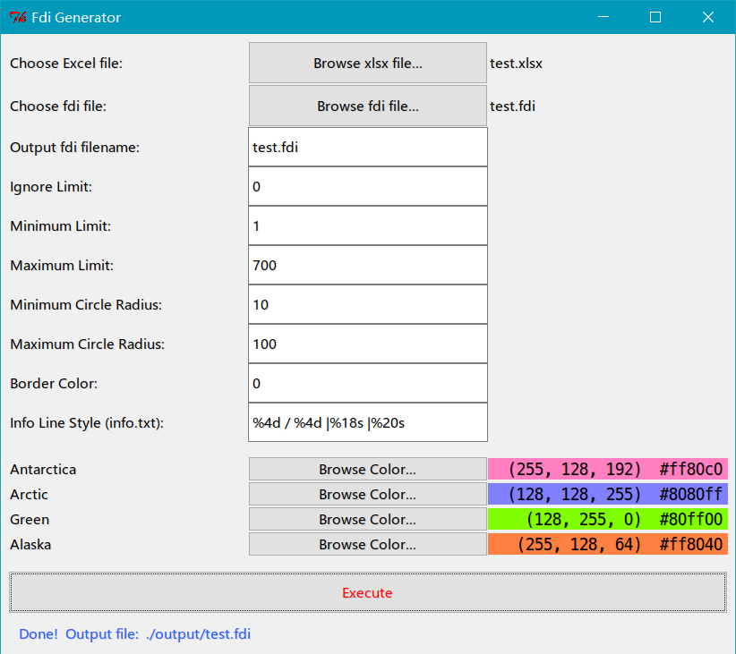

Fdi Generator
=============

A GUI tool for quickly generating new fdi files with different proportions and colors.

Screenshot
----------

Display fdi files with Network program
--------------------------------------

Usage
-----

1. For Windows users, please install Python 2 / Python 3 before running this program.
2. For Linux & Mac OSX users, Pyton was preinstalled.
3. Double click to run.

Excel syntax
-------------

MUST BE `xlsx` format!

Sample:

    Antarctica	Arctic	Green	Alaska
    0.106520 	2.365131 	7.454275 	0.017415
    0.000000 	0.039667 	0.077022 	0.011195
    0.025198 	0.000000 	0.000000 	0.000000
    0.374540 	0.295435 	0.257368 	12.098841
    ...         ...         ...         ...

