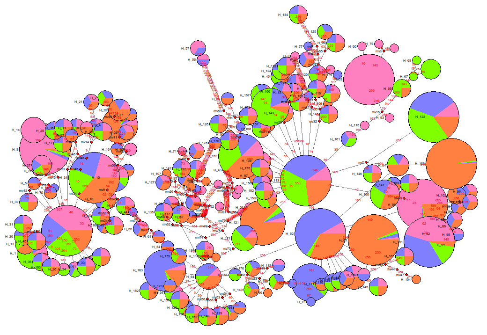

Fdi Generator
=============

A GUI tool for quickly generating new fdi files with different proportions and colors.

Screenshot
----------

Display fdi files with Network program
--------------------------------------

Display fdi file with [Network program](http://www.fluxus-engineering.com/sharenet.htm):

Prerequisites and Usage
-----------------------

Prerequisites:

- For Windows users, please install [Python2](https://www.python.org/downloads/) or [Python3](https://www.python.org/downloads/) before running this program.
- For Linux & Mac OSX users, Python was already installed.
- If you have Python library `pillow` installed, there will be images files generated in `images` folder after you execute the program (`pip install pillow`).

Usage:

- Download the zip file: [FdiGenerator.zip](https://github.com/zxjsdp/bioinfo-scripts/raw/master/Haplotype_Related/FdiGenerator/FdiGenerator.zip)
- Unzip and double click `FdiGenerator.pyw` or `fdi_generator.py` to run.
- If you want to see error messages, `cd` to the dir where python script is in and run this command on terminal (recommended):

      python fdi_generator.py

Excel syntax
-------------

- MUST BE `xlsx` format!
- First line should be names (color selector for each name will be generated automatically after xlsx file was selected)
- Lines from second line should be numbers

Sample:

    Antarctica    Arctic      Green       Alaska
    0.106520      2.365131    7.454275    0.017415
    0.000000      0.039667    0.077022    0.011195
    0.025198      0.000000    0.000000    0.000000
    0.374540      0.295435    0.257368    12.098841
    ...           ...         ...         ...
